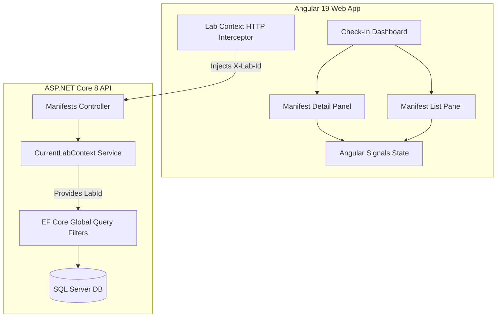

# System Features & Module-Wise Technical Documentation

This document provides a comprehensive, module-wise technical breakdown of the **Specimen Check-In and Reconciliation System**. This guide is prepared to detail the architectural decisions, design patterns, and features for review by technical interviewers.

---

## 🗺️ System Overview

The system is a **Multi-Tenant Pathology Lab Specimen Check-In Application** designed to manage and reconcile clinical specimen shipments (Manifests) sent from source clinics to pathology testing labs.

### Key Objectives
1. **Strict Tenant Boundaries:** Prevent cross-contamination of patient and manifest data between different Pathology Labs (Tenants).
2. **Reconciliation Security:** Guard the manifest closure process to ensure no manifest can be closed with unresolved specimens or active discrepancies.
3. **High-Performance Development:** Local database setup using SQL Server inside Docker, supported by an idempotent data seeder for mock diagnostics.
4. **Intuitive, Responsive UX:** A state-of-the-art dark-glassmorphism dashboard built with Angular standalone components and reactive states.

---

## 🏛️ Module-Wise Architecture

---

## 📦 1. Database & Persistence Module (`SpecimenCheckIn.Api/Data`)

This module manages Entity Framework Core database modeling, relationships, migrations, and tenant-scoped query execution rules.

### Core Entities & Domain Schema
- **Lab (Tenant):** Represents the boundary of data isolation.
  - Fields: `Id` (Guid), `Name` (String).
- **Manifest (Shipment):** Represents a collection of expected specimens.
  - Fields: `Id` (Guid), `LabId` (FK), `Code` (String), `Status` (`Open` / `Closed` / `ClosedWithDiscrepancy`), `SentAt` (DateTime), `SourceClinic` (String).
- **Specimen (Samples):** Individual physical containers expected in a shipment.
  - Fields: `Id` (Guid), `ManifestId` (FK), `Code` (String), `Patient` (String), `Site` (String), `Provider` (String), `Status` (`Pending` / `Received` / `Flagged`), `ReceivedBy` (String, nullable), `ReceivedAt` (DateTime, nullable).
- **Discrepancy (Anomalies):** Discrepancies raised during receipt (e.g. missing tubes, damaged labels).
  - Fields: `Id` (Guid), `ManifestId` (FK), `SpecimenId` (FK, nullable), `Type` (`Missing` / `OffManifest`), `Status` (`Open` / `Resolved`), `Notes` (String, nullable).

### Key Technical Implementations
1. **Global Query Filters:** Under the hood, `ApplicationDbContext` enforces filters on data queries:
   - `Manifest` queries are scoped directly to the current tenant ID: `m => m.LabId == _labContext.LabId`.
   - `Specimen` and `Discrepancy` queries traverse the manifest navigation property to enforce tenant boundaries: `s => s.Manifest.LabId == _labContext.LabId`.
   - *Security Benefit:* Developers can write standard EF queries (e.g. `_context.Specimens.ToList()`) without manually appending `.Where(s => s.LabId == ...)` clauses, neutralizing SQL injection and accidental tenant data leaks.
2. **String Enum Mapping:** Enums (e.g. `SpecimenStatus`, `ManifestStatus`, `DiscrepancyType`) are stored in the database as string representation values for human-readable auditability and easy debugging via SSMS.
3. **Restrictive Deletion Paths:** Configured relationship boundaries (such as `Discrepancy` -> `Specimen` with `DeleteBehavior.Restrict`) to prevent cascade loops in SQL Server.

---

## 🌐 2. Backend Web API Module (`SpecimenCheckIn.Api/Controllers` & `/Services`)

This module exposes scoped REST endpoints and handles requests, responses, and dependency injection.

### Active Tenant Context resolver
- **`ICurrentLabContext` & `CurrentLabContext`:** Registered as a scoped service in dependency injection. Reads the `X-Lab-Id` custom header from incoming HTTP requests.
- This context is injected directly into `ApplicationDbContext`, providing the active `LabId` for global query filters and automatically stamping incoming manifests with their owner's `LabId` upon save.

### Endpoints Implemented in `ManifestsController`
- `GET /api/manifests`: Retrieves manifests belonging exclusively to the active lab context.
- `GET /api/manifests/{id}`: Detailed manifest information (including child specimens). Returns `404 Not Found` if the manifest is missing or belongs to a different lab context.
- `POST /api/manifests/{id}/specimens/{sid}/receive`: Marks a specimen as received. It records the current time (`ReceivedAt`) and operator name (`ReceivedBy`). This endpoint is **idempotent**: if already received, it returns a `200 Ok` without database rewrites. It also auto-resolves any open `Missing` discrepancies linked to the specimen.
- `POST /api/manifests/{id}/specimens/{sid}/flag`: Sets a specimen's status to `Flagged` and creates an open `Missing` discrepancy.
- `POST /api/manifests/{id}/close`: Validates manifest reconciliation. If there are outstanding specimens or open discrepancies, it aborts the operation and returns a `409 Conflict` containing a structured `ProblemDetails` error listing unresolved items. Otherwise, it sets the status to `Closed`.

---

## 🧪 3. Quality Assurance & Test Module (`SpecimenCheckIn.Tests`)

A robust suite of **xUnit** integration and unit tests using EF Core's `InMemory` database provider.

### Implemented Test Suites
1. **Tenant Isolation on List (`GetManifests`):** Asserts that listing manifests only returns results belonging to the active lab context, even when multiple labs have data populated.
2. **Tenant Isolation on Details (`GetManifest`):** Verifies that querying a manifest belonging to Lab A with a Lab B header context returns a `404 Not Found` rather than a `200 Ok` or a `403 Forbidden` (obscuring database existence from unauthorized tenants).
3. **Idempotency Verification:** Asserts that calling the specimen receive endpoint multiple times on the same specimen succeeds, and the original receipt timestamp remains unchanged.
4. **Reconciliation Checks:**
   - Verifies that attempting to close a manifest containing `Pending` specimens results in a `409 Conflict` error.
   - Verifies that closing a fully checked-in manifest succeeds and sets status to `Closed`.

---

## 💻 4. Frontend Angular Module (`specimen-checkin-web`)

A modern web app using Angular standalone component architecture (no legacy `NgModule` declarations), Reactive Forms, and HttpClient.

### Shared State Architecture (Angular Signals)
- Uses Angular **Signals** inside `ManifestService` to share state reactively:
  - `selectedManifestId = signal<string>('')`
  - `selectedManifest = signal<Manifest | null>(null)`
- Any component that injects `ManifestService` binds to these signals, eliminating complex parent-child event bubbles and keeping panels in sync.

### Key Components
1. **`CheckInDashboard` (Main Shell):**
   - Renders a multi-tenant header including a dropdown to switch labs and an operator identity input.
   - Houses the left panel and right panel, managing responsive display states.
   - Includes connection-retry handlers and loader skeletons.
2. **`ManifestList` (Left Panel):**
   - Lists shipments and displays status badges indicating transit, check-in progress, or unresolved discrepancies.
3. **`ManifestDetail` (Right Panel):**
   - Displays sample reception metrics in colored stats tiles.
   - Displays a specimen table with action buttons (`✓ Receive`, `⚠ Flag`).
   - Manages the modal dialog for raising discrepancies.
4. **`StatusClassPipe` (Reusable Pipe):**
   - A standalone pipe mapping state enums (Pending, Received, Flagged, Open, Closed) to CSS classes, keeping templates clean.

### Responsive Design (Mobile / Tablet / Desktop)
- **Viewport Layout Adjustment:** Desktop uses a side-by-side panel layout. Mobile (max-width `992px`) stacks the columns and shows either the list or the detail panel.
- **Mobile Back Button:** Mobile view adds a prominent `← Back to Shipments` button to return to the list view.
- **Adaptive Columns:** Mobile view dynamically hides non-critical columns (Site, Provider, Received By, and At) to ensure the table layout remains readable without horizontal scrolling.

---

## 💎 Technical Decisions & Trade-Offs

- **Tenant Isolation at DB Context Level:** Enforcing multi-tenant isolation within the Entity Framework `DbContext` ensures developer error cannot expose sensitive cross-tenant data. Even if a controller developer forgets to append a filter, the database queries are locked down.
- **Functional HttpInterceptor:** Intercepting HTTP requests globally to inject the active `X-Lab-Id` header keeps individual services clean and decoupled from tenant headers.
- **Angular Signals:** Choosing Signals over RxJS BehaviorSubjects provides cleaner templates, automatic dependency tracking, and reduced change detection overhead.
- **ProblemDetails Format (RFC 7807):** Standardizing all errors around RFC 7807 ProblemDetails ensures the client receives a structured response, easing validation parsing in the frontend.
